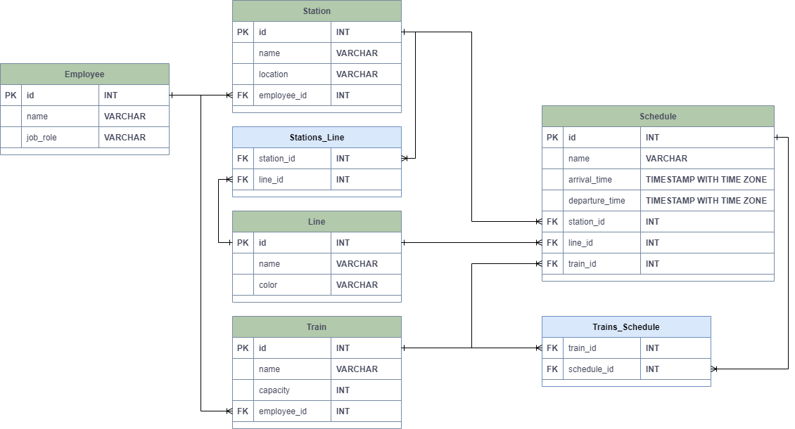

# Data Modeling

## Table of Contents

- [Entity Relationship Diagram](#entity-relationship-diagram)
- [Detailed Table Information](#detailed-table-information)
    - [System_user](#systemuser)
    - [Employee](#employee)
    - [Trains](#trains)
    - [Lines](#lines)
    - [Stations](#stations)
    - [Schedule](#schedule)
- [Junction Tables](#junction-tables)
    - [Stations_Line](#stationsline)
    - [Trains_Schedule](#trainsschedule)
- [Relationships Explained](#relationships-explained)

## Entity Relationship Diagram

## Detailed Table Information

### System_user

| Column   | Type    | Description                               |
|----------|---------|-------------------------------------------|
| id       | PK      | The unique identifier of the system_user. |
| name     | VARCHAR | The name of the system_user.              |
| password | VARCHAR | The password of the system_user.          |

### Employee

| Column   | Type    | Description                            |
|----------|---------|----------------------------------------|
| id       | PK      | The unique identifier of the employee. |
| name     | VARCHAR | The name of the employee.              |
| job_role | VARCHAR | The role or job title of the employee. |

### Trains

| Column      | Type     | Description                           |
|-------------|----------|---------------------------------------|
| id          | PK       | The unique identifier of the train.   |
| name        | VARCHAR  | The name of the train.                |
| capacity    | INT      | The capacity of the train.            |
| employee_id | FK (INT) | The employees assigned to this train. |

### Lines

| Column | Type    | Description                         |
|--------|---------|-------------------------------------|
| id     | PK      | The unique identifier of the line.  |
| name   | VARCHAR | The name of the line.               |
| color  | VARCHAR | The color associated with the line. |

### Schedule

| Column         | Type                     | Description                                                 |
|----------------|--------------------------|-------------------------------------------------------------|
| id             | PK                       | The unique identifier of the schedule.                      |
| name           | VARCHAR                  | The name of the schedule.                                   |
| arrival_time   | TIMESTAMP WITH TIME ZONE | A list of the arrival times for each station on the line.   |
| departure_time | TIMESTAMP WITH TIME ZONE | A list of the departure times for each station on the line. |
| station_id     | FK (INT)                 | The station that follows this schedule.                     |
| line_id        | FK (INT)                 | The lines that follows this schedule.                       |
| train_id       | FK (INT)                 | The train that follows this schedule.                       |

### Stations

| Column      | Type     | Description                             |
|-------------|----------|-----------------------------------------|
| id          | PK       | The unique identifier of the station.   |
| name        | VARCHAR  | The name of the station.                |
| location    | VARCHAR  | The address location of the station.    |
| employee_id | FK (INT) | The employees assigned to this station. |

## Junction Tables

### Stations_Line

| Column     | Type     | Description |
|------------|----------|-------------|
| station_id | FK (INT) | Station id  |
| line_id    | FK (INT) | Line id     |

### Trains_Schedule

| Column      | Type     | Description |
|-------------|----------|-------------|
| train_id    | FK (INT) | Train id    |
| schedule_id | FK (INT) | Schedule id |

## Relationships Explained

The relationships between the tables are:

`Employee` to `Station`: Many-to-One (an employee may be assigned to one station, but a station may have many employees)

`Lines` to `Stations`: Many-to-Many (a line may have many stations, and a station may be served by many lines)
\
`Stations` to `Lines`: Many-to-Many (same as above)

`Lines` to `Schedule`: One-to-Many (a line may have many schedules, but a schedule is associated with only one line)
\
`Schedule` to `Lines`: Many-to-One (same as above)

`Stations` to `Schedule`: One-to-Many (a station may have many schedules, but a schedule is associated with only one
station)
\
`Schedule` to `Stations`: Many-to-One (same as above)

`Trains` to `Schedule`: One-to-Many (a train may have many scheduled stops, but a scheduled stop is associated with only
one train)
\
`Schedule` to `Trains`: Many-to-One (same as above)
